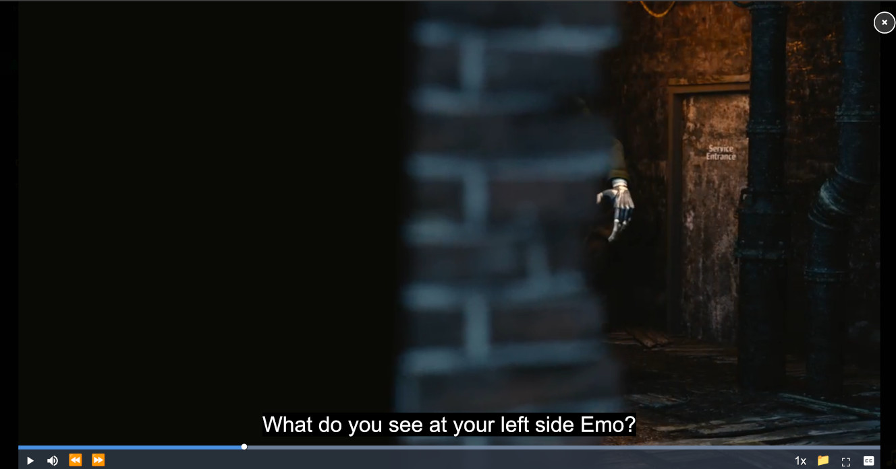

# Video.js Enhanced Plugin for Copyparty

A comprehensive Video.js plugin for copyparty file server with advanced features including automatic subtitle loading, custom playback controls, and MPEG-TS support.


## Features

### 🎬 Video Playback
- **Multiple Format Support**: MP4, WebM, OGG, MKV, AVI, MOV, M3U8 (HLS), and TS (MPEG-TS)
- **MPEG-TS Optimization**: HTTP range-based seeking with lazy loading for `.ts` files
- **mpegts.js Integration**: Automatic loading for transport stream files
- **Responsive Modal Player**: Fullscreen overlay with proper aspect ratio handling

### 📝 Subtitle Management
- **Automatic Detection**: Scans for `.srt` and `.vtt` subtitle files automatically
- **English Priority**: Auto-selects English subtitles as default track
- **Multiple Languages**: Supports English, Vietnamese, Japanese, and custom patterns
- **Format Conversion**: Automatic SRT to VTT conversion
- **Manual Upload**: Upload custom subtitle files (SRT, VTT, ASS formats)
- **Language Patterns**:
  - `video.srt` / `video.vtt`
  - `video.en.srt` / `video-en.srt`
  - `video.vi.srt` / `video.ja.srt`

### 🎮 Enhanced Controls
- **⏪ Rewind 5s**: Skip backward 5 seconds
- **⏩ Forward 5s**: Skip forward 5 seconds
- **Clickable Time Display**: Toggle between elapsed time and remaining time
- **Variable Playback Speed**: 0.25x to 2x speed control
- **Auto-hide Controls**: Fade out after 3 seconds of inactivity
- **Dynamic Fullscreen Icon**: Changes icon based on fullscreen state (⛶/⊗)
- **Tooltips**: Hover over any control to see its function

### 🎨 UI Enhancements
- **Right-aligned Controls**: Speed, subtitle, and fullscreen controls aligned to the right
- **Smooth Animations**: Fade transitions for control visibility
- **Dark Theme**: Optimized for low-light viewing
- **Hover Effects**: Visual feedback on all interactive elements
- **Custom Subtitle Styling**: Large, readable subtitles with shadows

## Installation

### For Copyparty

Load the plugin when starting copyparty:

```bash
copyparty --js-browser /path/to/videojs-enhanced-fixed.js
```

### File Location

Place the script file in a directory accessible by your copyparty server, for example:
```
/downloads/.copyparty-videojs/videojs-enhanced-fixed.js
```

## Usage

1. **Start Copyparty** with the plugin loaded
2. **Browse to a video file** in the copyparty web interface
3. **Click on the video file** - the enhanced player will open automatically
4. **Subtitles**: Place subtitle files with the same name as the video file
   - Example: `movie.mp4` → `movie.srt` or `movie.en.srt`

## Control Layout

```
┌─────────────────────────────────────────────────────────────────────┐
│ [Progress Bar - Full Width]                                          │
├─────────────────────────────────────────────────────────────────────┤
│ ▶ 🔊 ⏪ ⏩ 00:00 / 10:00 ════════[gap]════════ 1x 📁 CC ⛶         │
└─────────────────────────────────────────────────────────────────────┘

Legend:
▶  = Play/Pause
🔊 = Volume
⏪ = Rewind 5 seconds
⏩ = Forward 5 seconds
00:00 = Current time (click to toggle elapsed/remaining)
/ = Divider
10:00 = Duration
1x = Playback speed
📁 = Upload subtitle
CC = Subtitle tracks
⛶ = Fullscreen (changes to ⊗ when fullscreen)
```

## Keyboard Shortcuts

Standard Video.js keyboard shortcuts apply:
- **Space**: Play/Pause
- **←/→**: Skip 5 seconds (with custom buttons)
- **↑/↓**: Volume control
- **F**: Toggle fullscreen
- **M**: Mute/Unmute

## Supported Video Formats

| Format | Extension | Notes |
|--------|-----------|-------|
| MP4 | `.mp4`, `.m4v` | Native HTML5 support |
| WebM | `.webm` | Native HTML5 support |
| OGG | `.ogg`, `.ogv` | Native HTML5 support |
| Matroska | `.mkv` | Browser-dependent |
| AVI | `.avi` | Browser-dependent |
| QuickTime | `.mov` | Browser-dependent |
| MPEG-TS | `.ts` | Via mpegts.js (lazy loaded) |
| HLS | `.m3u8` | Native or via VHS |

## Subtitle Formats

- **VTT** (WebVTT): Native support, no conversion needed
- **SRT** (SubRip): Automatically converted to VTT
- **ASS** (Advanced SubStation): Automatically converted to VTT

## Technical Details

### Dependencies
- **Video.js**: 8.17.3 (loaded from CDN)
- **mpegts.js**: Latest (lazy loaded for `.ts` files only)

### CDN Resources
- Video.js CSS: `https://vjs.zencdn.net/8.17.3/video-js.css`
- Video.js Script: `https://vjs.zencdn.net/8.17.3/video.min.js`
- mpegts.js: `https://cdn.jsdelivr.net/npm/mpegts.js/dist/mpegts.min.js`

### Performance Optimizations
- **Lazy Loading**: mpegts.js only loads when needed
- **HTTP Range Seeking**: Efficient seeking in large `.ts` files
- **Sequential Subtitle Checks**: Reduces 404 spam with 50ms delays
- **Auto Cleanup**: Manages source buffers for long playback sessions

## Browser Compatibility

- ✅ Chrome/Edge (Recommended)
- ✅ Firefox
- ✅ Safari (with limitations on some formats)
- ✅ Modern mobile browsers (iOS Safari, Chrome Mobile)

## Troubleshooting

### Subtitles Not Loading
- Ensure subtitle file is in the same directory as video
- Check subtitle file name matches video name
- Verify file format is `.srt` or `.vtt`
- Check browser console for 404 errors

### Video Won't Play
- Check if browser supports the video format
- For `.ts` files, ensure network allows CDN access to mpegts.js
- Try refreshing the page
- Check browser console for errors

### Controls Not Hiding
- Mouse movement resets the 3-second timer
- Controls always show when video is paused
- Ensure JavaScript is enabled

## Configuration

The plugin is designed to work out-of-the-box with sensible defaults:
- **Auto-hide delay**: 3 seconds
- **Skip duration**: 5 seconds
- **Playback speeds**: 0.25x, 0.5x, 0.75x, 1x, 1.25x, 1.5x, 1.75x, 2x
- **Subtitle check delay**: 50ms between patterns

## License

This plugin integrates with:
- Video.js (Apache 2.0 License)
- mpegts.js (Apache 2.0 License)
- Copyparty (MIT License)

## Version

**Current Version**: Enhanced with auto-hide controls, clickable time display, and dynamic fullscreen icons

**Video.js Version**: 8.17.3
